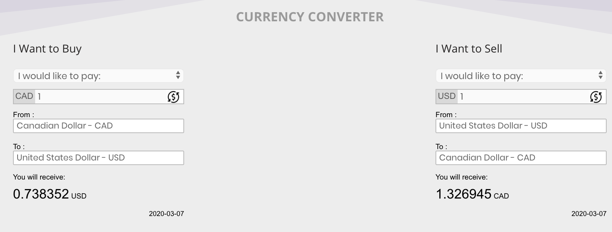

# Currency Converter using the Fixer.io API

[MoneyExchangers.ca](http://moneyexchangers.ca/)

The JavaScript in this repo was intergrated later on into this design:

So please ignore the HTML file... it was just used to make sure everything was working first.

Simply insert your own access key and start converting currencies!
